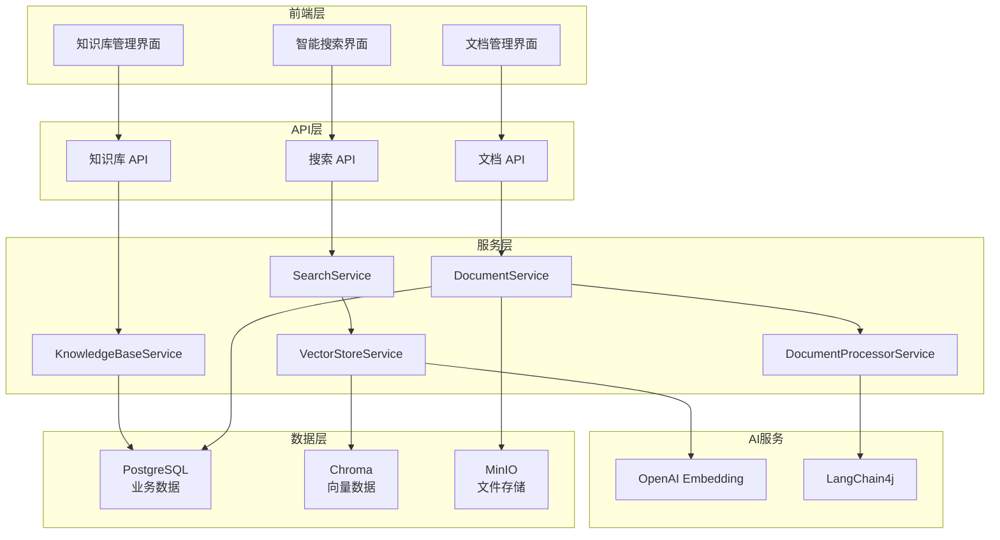

# 第二阶段开发完成报告

## 🎉 第二阶段：知识库功能开发 - 已完成

### ✅ 完成的功能

#### 1. 数据模型设计
- [x] 知识库实体 (KnowledgeBase)
- [x] 文档实体 (Document) 
- [x] 文档分块实体 (DocumentChunk)
- [x] 完整的数据库迁移脚本
- [x] 实体关系和索引优化

#### 2. 后端核心服务
- [x] **文档处理服务** (DocumentProcessorService)
  - 多格式文档解析 (PDF, Word, TXT, Markdown)
  - 智能文档分块
  - Token 数量估算
  - 文件类型验证

- [x] **向量存储服务** (VectorStoreService)
  - OpenAI Embedding 集成
  - Chroma 向量数据库操作
  - 批量向量化处理
  - 语义相似度搜索

- [x] **知识库管理服务** (KnowledgeBaseService)
  - 知识库 CRUD 操作
  - 权限验证和数据隔离
  - 统计信息更新
  - 搜索和筛选功能

- [x] **文档管理服务** (DocumentService)
  - 文档上传和存储
  - 异步文档处理
  - 文档状态管理
  - 文件清理和删除

- [x] **搜索服务** (SearchService)
  - 语义搜索实现
  - 混合搜索支持
  - RAG 上下文生成
  - 搜索结果排序和过滤

#### 3. RESTful API 接口
- [x] **知识库管理 API**
  - `POST /api/knowledge-bases` - 创建知识库
  - `GET /api/knowledge-bases` - 获取知识库列表
  - `GET /api/knowledge-bases/{id}` - 获取知识库详情
  - `PUT /api/knowledge-bases/{id}` - 更新知识库
  - `DELETE /api/knowledge-bases/{id}` - 删除知识库
  - `GET /api/knowledge-bases/search` - 搜索知识库

- [x] **文档管理 API**
  - `POST /api/knowledge-bases/{id}/documents/upload` - 上传文档
  - `POST /api/knowledge-bases/{id}/documents/{docId}/process` - 处理文档
  - `GET /api/knowledge-bases/{id}/documents` - 获取文档列表
  - `DELETE /api/knowledge-bases/{id}/documents/{docId}` - 删除文档

- [x] **搜索 API**
  - `POST /api/search/semantic` - 语义搜索
  - `POST /api/search/hybrid` - 混合搜索
  - `GET /api/search/context` - 获取 RAG 上下文

#### 4. 前端界面开发
- [x] **知识库管理界面** (KnowledgeBaseList)
  - 知识库列表展示
  - 创建/编辑知识库表单
  - 知识库状态管理
  - 统计信息显示

- [x] **文档管理界面** (DocumentManagement)
  - 拖拽上传文档
  - 文档列表和状态显示
  - 文档处理进度跟踪
  - 文档删除确认

- [x] **智能搜索界面** (SearchInterface)
  - 语义搜索和混合搜索
  - 搜索参数配置
  - 搜索结果高亮显示
  - 相似度评分展示

#### 5. 技术集成
- [x] **LangChain4j 集成**
  - OpenAI Embedding 模型配置
  - 文档解析器集成
  - 文档分割器配置
  - Chroma 向量存储集成

- [x] **前端状态管理**
  - TypeScript 类型定义
  - React Query 数据获取
  - Zustand 状态管理
  - API 客户端封装

### 📊 技术架构



### 🔧 核心功能流程

#### 文档处理流程
1. **文档上传** → 文件验证 → 存储到 MinIO
2. **文档解析** → LangChain4j 解析器 → 提取文本内容
3. **文档分块** → 智能分割 → 生成文本片段
4. **向量化** → OpenAI Embedding → 生成向量表示
5. **存储** → Chroma 向量库 + PostgreSQL 元数据

#### 语义搜索流程
1. **查询输入** → 用户输入搜索问题
2. **向量化** → OpenAI Embedding → 查询向量
3. **相似度搜索** → Chroma 检索 → 相关文档片段
4. **结果排序** → 相似度评分 → 返回最相关结果
5. **结果展示** → 高亮显示 → 元数据信息

### 📁 项目结构更新

```
backend/src/main/java/com/agent/platform/
├── knowledge/                   # 知识库模块 ✅
│   ├── entity/                  # 实体类
│   │   ├── KnowledgeBase.java
│   │   ├── Document.java
│   │   └── DocumentChunk.java
│   ├── repository/              # 数据访问层
│   │   ├── KnowledgeBaseRepository.java
│   │   ├── DocumentRepository.java
│   │   └── DocumentChunkRepository.java
│   ├── service/                 # 业务逻辑层
│   │   ├── KnowledgeBaseService.java
│   │   ├── DocumentService.java
│   │   ├── SearchService.java
│   │   ├── DocumentProcessorService.java
│   │   └── VectorStoreService.java
│   ├── controller/              # 控制器层
│   │   ├── KnowledgeBaseController.java
│   │   ├── DocumentController.java
│   │   └── SearchController.java
│   └── dto/                     # 数据传输对象
│       ├── KnowledgeBaseCreateRequest.java
│       ├── KnowledgeBaseResponse.java
│       ├── DocumentUploadResponse.java
│       ├── SearchRequest.java
│       └── SearchResult.java
├── config/
│   └── LangChain4jConfig.java   # LangChain4j 配置 ✅
└── common/
    └── exception/
        └── BusinessException.java ✅

frontend/src/
├── types/
│   └── knowledge.ts             # 知识库类型定义 ✅
├── services/api/
│   └── knowledge.ts             # 知识库 API 服务 ✅
├── pages/knowledge/             # 知识库页面 ✅
│   ├── KnowledgeBaseList.tsx
│   ├── DocumentManagement.tsx
│   └── SearchInterface.tsx
└── components/common/Layout/
    └── MainLayout.tsx           # 更新布局 ✅
```

### 🚀 功能演示

#### 1. 知识库管理
- 创建知识库，配置嵌入模型和分块参数
- 查看知识库统计信息（文档数、Token数）
- 编辑和删除知识库

#### 2. 文档上传和处理
- 支持拖拽上传 PDF、Word、TXT、Markdown 文件
- 实时显示文档处理状态
- 自动文档分块和向量化

#### 3. 智能搜索
- 语义搜索：理解查询意图，返回相关内容
- 混合搜索：结合关键词和语义搜索
- 可配置搜索参数（结果数量、相似度阈值）
- 搜索结果高亮显示

### 🧪 测试验证

#### API 测试
```bash
# 创建知识库
curl -X POST http://localhost:8080/api/knowledge-bases \
  -H "Authorization: Bearer <token>" \
  -H "Content-Type: application/json" \
  -d '{"name":"测试知识库","description":"用于测试的知识库"}'

# 上传文档
curl -X POST http://localhost:8080/api/knowledge-bases/1/documents/upload \
  -H "Authorization: Bearer <token>" \
  -F "file=@test.pdf"

# 语义搜索
curl -X POST http://localhost:8080/api/search/semantic \
  -H "Authorization: Bearer <token>" \
  -H "Content-Type: application/json" \
  -d '{"knowledgeBaseId":1,"query":"人工智能的发展历程"}'
```

#### 前端测试
1. 访问 http://localhost:3000/knowledge
2. 创建新知识库
3. 上传测试文档
4. 进行语义搜索测试

### 📋 下一步计划

#### 第三阶段：工作流功能 (预计 2-3周)
1. **工作流设计器**
   - 可视化节点编辑器
   - 拖拽式工作流构建
   - 节点配置面板

2. **工作流引擎**
   - 工作流执行引擎
   - 变量传递和上下文管理
   - 条件分支和循环

3. **预置节点类型**
   - LLM 对话节点
   - 知识库检索节点
   - HTTP 请求节点
   - 条件判断节点

4. **工作流管理**
   - 工作流版本管理
   - 执行历史记录
   - 性能监控

### 🐛 已知问题

1. **文档处理优化**
   - 大文件处理性能需要优化
   - 需要添加处理进度显示

2. **搜索功能增强**
   - 需要实现关键词搜索
   - 搜索结果需要添加更多过滤选项

3. **错误处理**
   - 需要完善文档处理失败的重试机制
   - 添加更详细的错误信息显示

### 💡 优化建议

1. **性能优化**
   - 实现文档处理队列
   - 添加向量搜索缓存
   - 优化大文件上传

2. **用户体验**
   - 添加处理进度条
   - 实现实时搜索建议
   - 优化移动端适配

3. **功能扩展**
   - 支持更多文档格式
   - 实现文档预览功能
   - 添加搜索历史记录

### 🎯 总结

第二阶段的知识库功能开发已经完成，包括：
- ✅ 完整的文档上传和处理流程
- ✅ 基于 LangChain4j 的向量化存储
- ✅ 智能语义搜索功能
- ✅ 现代化的前端管理界面
- ✅ RESTful API 接口设计

项目已具备完整的知识库管理和智能搜索能力，可以开始第三阶段的工作流功能开发！🚀