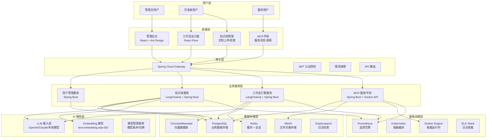
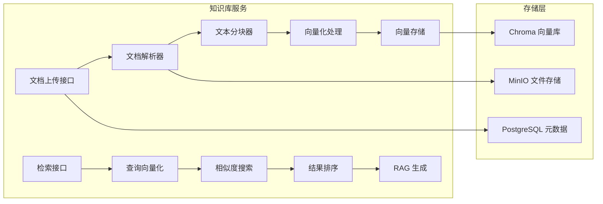
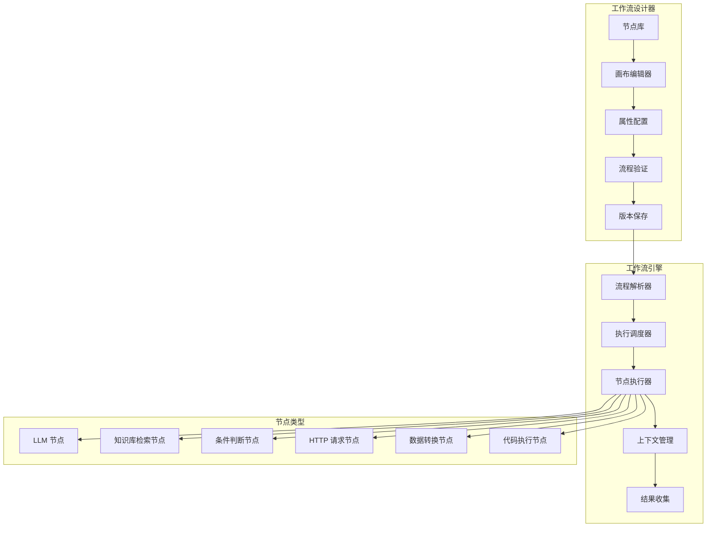
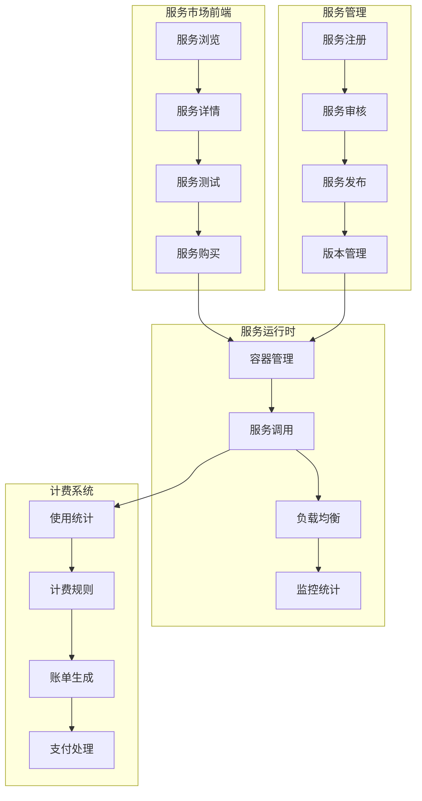
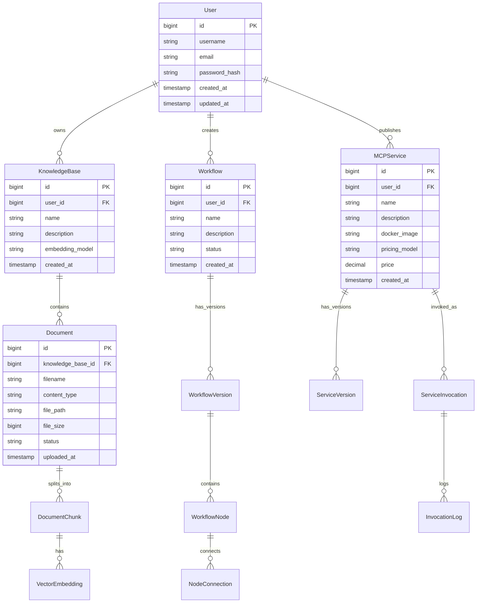

# AI Agent Platform 技术架构方案

## 1. 项目概述

### 1.1 项目目标
构建一个基于 LangChain4j 的智能平台，集成知识库、工作流引擎和 MCP 服务市场三大核心功能，为用户提供完整的 AI 应用开发和部署解决方案。

### 1.2 核心功能模块
- **知识库模块**: 文档向量化存储、语义检索、RAG 问答
- **工作流引擎**: 可视化工作流设计、节点执行引擎、版本管理
- **MCP 服务市场**: 服务注册发现、容器化部署、调用监控

## 2. 整体架构设计

### 2.1 系统架构图

### 2.2 技术栈选型

#### 后端技术栈
| 组件 | 技术选型 | 版本 | 选型理由 |
|------|----------|------|----------|
| 核心框架 | Spring Boot | 3.2+ | 成熟稳定，生态丰富 |
| AI 框架 | LangChain4j | 0.34+ | Java 生态最佳 LLM 框架 |
| 数据库 | PostgreSQL | 15+ | 支持向量扩展，性能优秀 |
| 向量数据库 | Chroma | Latest | 轻量级，易部署 |
| 缓存 | Redis | 7+ | 高性能内存数据库 |
| 文件存储 | MinIO | Latest | S3 兼容，私有化部署 |
| 消息队列 | RabbitMQ | 3.12+ | 可靠性高，功能丰富 |
| 搜索引擎 | Elasticsearch | 8+ | 全文检索，日志分析 |

#### 前端技术栈
| 组件 | 技术选型 | 版本 | 选型理由 |
|------|----------|------|----------|
| 框架 | React | 18+ | 生态成熟，组件丰富 |
| 语言 | TypeScript | 5+ | 类型安全，开发效率高 |
| 构建工具 | Vite | 5+ | 快速构建，热更新 |
| UI 组件库 | Ant Design | 5+ | 企业级 UI 组件 |
| 状态管理 | Zustand | 4+ | 轻量级，易使用 |
| 工作流设计 | React Flow | 11+ | 专业的流程图组件 |
| HTTP 客户端 | Axios | 1.6+ | 功能完善的 HTTP 库 |

## 3. 核心模块详细设计

### 3.1 知识库模块架构

#### 核心功能
1. **文档处理流水线**
   - 支持格式：PDF, DOCX, TXT, MD, HTML
   - 智能分块：基于语义的文档分割
   - 元数据提取：标题、作者、创建时间等

2. **向量化存储**
   - 嵌入模型：text-embedding-ada-002
   - 向量维度：1536
   - 存储引擎：Chroma 向量数据库

3. **语义检索**
   - 混合检索：向量检索 + 关键词检索
   - 重排序：基于相关性的结果重排
   - 上下文增强：检索结果上下文扩展

### 3.2 工作流引擎架构

#### 核心功能
1. **可视化设计器**
   - 拖拽式节点编辑
   - 连线和流程控制
   - 实时预览和调试

2. **执行引擎**
   - 异步执行支持
   - 错误处理和重试
   - 执行状态跟踪

3. **节点类型系统**
   - 内置节点：LLM、检索、条件等
   - 自定义节点：支持插件扩展
   - 节点配置：参数化配置

### 3.3 MCP 服务市场架构

#### 核心功能
1. **服务注册发现**
   - 服务元数据管理
   - 服务健康检查
   - 服务版本控制

2. **容器化部署**
   - Docker 镜像管理
   - 动态容器调度
   - 资源限制和监控

3. **调用和计费**
   - API 网关集成
   - 使用量统计
   - 灵活计费模式

## 4. 数据模型设计

### 4.1 核心实体关系图

## 5. 安全架构设计

### 5.1 安全策略
1. **身份认证**
   - JWT Token 认证
   - OAuth2 第三方登录
   - 多因子认证支持

2. **权限控制**
   - RBAC 角色权限模型
   - 资源级别权限控制
   - API 接口权限验证

3. **数据安全**
   - 数据传输 HTTPS 加密
   - 敏感数据存储加密
   - 数据备份和恢复

4. **容器安全**
   - 镜像安全扫描
   - 容器运行时隔离
   - 网络安全策略

## 6. 性能优化策略

### 6.1 缓存策略
- **Redis 缓存**：热点数据、会话信息
- **应用缓存**：查询结果、计算结果
- **CDN 缓存**：静态资源、文件下载

### 6.2 数据库优化
- **索引优化**：查询性能优化
- **分库分表**：大数据量处理
- **读写分离**：负载均衡

### 6.3 向量检索优化
- **索引算法**：HNSW 近似最近邻
- **量化压缩**：向量存储优化
- **批量处理**：提高吞吐量

## 7. 监控和运维

### 7.1 监控体系
- **应用监控**：Prometheus + Grafana
- **日志监控**：ELK Stack
- **链路追踪**：Jaeger
- **告警通知**：钉钉、邮件、短信

### 7.2 运维自动化
- **CI/CD**：Jenkins/GitLab CI
- **容器编排**：Kubernetes
- **配置管理**：ConfigMap/Secret
- **自动扩缩容**：HPA/VPA

## 8. 开发规范

### 8.1 代码规范
- **Java**：阿里巴巴 Java 开发手册
- **TypeScript**：ESLint + Prettier
- **Git**：Git Flow 工作流
- **文档**：接口文档、设计文档

### 8.2 测试策略
- **单元测试**：JUnit 5 + Jest
- **集成测试**：TestContainers
- **端到端测试**：Cypress
- **性能测试**：JMeter

这个技术架构方案为整个项目提供了完整的技术蓝图，接下来我将创建具体的实施步骤文档。