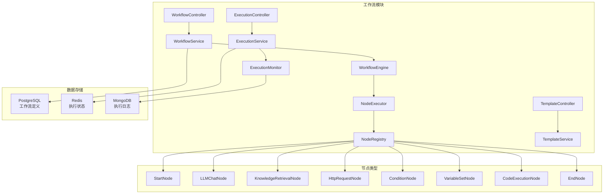
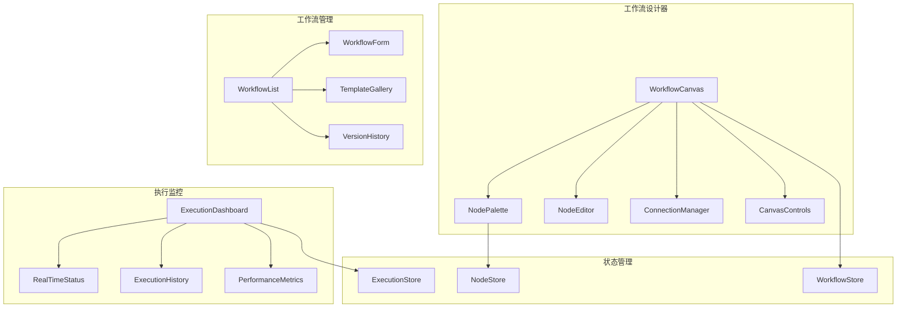

# 第三阶段：工作流功能开发计划

## 🎯 目标概述

构建一个可视化的工作流系统，类似于 Dify，支持拖拽式节点编辑、工作流执行引擎和丰富的预置节点类型。

## 📋 功能清单

### 1. 工作流设计器 (Workflow Designer)
- [x] 可视化画布组件
- [x] 节点拖拽和连接
- [x] 节点配置面板
- [x] 工作流保存和加载
- [x] 缩放和平移功能

### 2. 工作流引擎 (Workflow Engine)
- [x] 工作流解析器
- [x] 节点执行器
- [x] 变量传递和上下文管理
- [x] 条件分支处理
- [x] 错误处理和重试机制

### 3. 预置节点类型 (Built-in Node Types)
- [x] **开始节点** (Start Node)
- [x] **LLM 对话节点** (LLM Chat Node)
- [x] **知识库检索节点** (Knowledge Retrieval Node)
- [x] **HTTP 请求节点** (HTTP Request Node)
- [x] **条件判断节点** (Condition Node)
- [x] **变量设置节点** (Variable Set Node)
- [x] **代码执行节点** (Code Execution Node)
- [x] **结束节点** (End Node)

### 4. 工作流管理 (Workflow Management)
- [x] 工作流 CRUD 操作
- [x] 工作流版本管理
- [x] 工作流分类和标签
- [x] 工作流模板库

### 5. 执行监控 (Execution Monitoring)
- [x] 实时执行状态
- [x] 执行历史记录
- [x] 性能指标统计
- [x] 错误日志追踪

## 🏗️ 技术架构

### 后端架构


### 前端架构


## 📊 数据模型设计

### 工作流定义 (Workflow)
```sql
CREATE TABLE workflows (
    id BIGSERIAL PRIMARY KEY,
    name VARCHAR(255) NOT NULL,
    description TEXT,
    definition JSONB NOT NULL,  -- 工作流图结构
    version INTEGER DEFAULT 1,
    status VARCHAR(50) DEFAULT 'DRAFT',
    category VARCHAR(100),
    tags TEXT[],
    user_id BIGINT REFERENCES users(id),
    created_at TIMESTAMP DEFAULT CURRENT_TIMESTAMP,
    updated_at TIMESTAMP DEFAULT CURRENT_TIMESTAMP
);
```

### 工作流执行 (Workflow Execution)
```sql
CREATE TABLE workflow_executions (
    id BIGSERIAL PRIMARY KEY,
    workflow_id BIGINT REFERENCES workflows(id),
    status VARCHAR(50) DEFAULT 'RUNNING',
    input_data JSONB,
    output_data JSONB,
    context JSONB,  -- 执行上下文
    started_at TIMESTAMP DEFAULT CURRENT_TIMESTAMP,
    completed_at TIMESTAMP,
    error_message TEXT,
    user_id BIGINT REFERENCES users(id)
);
```

### 节点执行记录 (Node Execution)
```sql
CREATE TABLE node_executions (
    id BIGSERIAL PRIMARY KEY,
    execution_id BIGINT REFERENCES workflow_executions(id),
    node_id VARCHAR(255) NOT NULL,
    node_type VARCHAR(100) NOT NULL,
    status VARCHAR(50) DEFAULT 'PENDING',
    input_data JSONB,
    output_data JSONB,
    started_at TIMESTAMP,
    completed_at TIMESTAMP,
    duration_ms INTEGER,
    error_message TEXT
);
```

## 🔧 核心组件实现

### 1. 工作流引擎核心
```java
@Service
public class WorkflowEngine {
    
    @Autowired
    private NodeRegistry nodeRegistry;
    
    @Autowired
    private ExecutionService executionService;
    
    public WorkflowExecution executeWorkflow(Long workflowId, Map<String, Object> inputData) {
        // 1. 加载工作流定义
        Workflow workflow = workflowService.getById(workflowId);
        
        // 2. 创建执行上下文
        ExecutionContext context = new ExecutionContext(inputData);
        
        // 3. 开始执行
        WorkflowExecution execution = executionService.startExecution(workflow, context);
        
        // 4. 异步执行工作流
        CompletableFuture.runAsync(() -> executeNodes(workflow, execution, context));
        
        return execution;
    }
    
    private void executeNodes(Workflow workflow, WorkflowExecution execution, ExecutionContext context) {
        // 工作流执行逻辑
        WorkflowDefinition definition = workflow.getDefinition();
        Node startNode = findStartNode(definition);
        
        executeNode(startNode, execution, context);
    }
}
```

### 2. 节点注册器
```java
@Component
public class NodeRegistry {
    
    private final Map<String, NodeExecutor> executors = new HashMap<>();
    
    @PostConstruct
    public void registerNodes() {
        register("start", new StartNodeExecutor());
        register("llm_chat", new LLMChatNodeExecutor());
        register("knowledge_retrieval", new KnowledgeRetrievalNodeExecutor());
        register("http_request", new HttpRequestNodeExecutor());
        register("condition", new ConditionNodeExecutor());
        register("variable_set", new VariableSetNodeExecutor());
        register("code_execution", new CodeExecutionNodeExecutor());
        register("end", new EndNodeExecutor());
    }
    
    public NodeExecutor getExecutor(String nodeType) {
        return executors.get(nodeType);
    }
}
```

### 3. 前端工作流画布
```typescript
interface WorkflowCanvasProps {
  workflow: Workflow;
  onWorkflowChange: (workflow: Workflow) => void;
}

export const WorkflowCanvas: React.FC<WorkflowCanvasProps> = ({
  workflow,
  onWorkflowChange
}) => {
  const [nodes, setNodes] = useState<Node[]>(workflow.nodes || []);
  const [edges, setEdges] = useState<Edge[]>(workflow.edges || []);
  
  const onNodesChange = useCallback((changes: NodeChange[]) => {
    setNodes((nds) => applyNodeChanges(changes, nds));
  }, []);
  
  const onEdgesChange = useCallback((changes: EdgeChange[]) => {
    setEdges((eds) => applyEdgeChanges(changes, eds));
  }, []);
  
  const onConnect = useCallback((connection: Connection) => {
    setEdges((eds) => addEdge(connection, eds));
  }, []);
  
  return (
    <div className="workflow-canvas">
      <ReactFlow
        nodes={nodes}
        edges={edges}
        onNodesChange={onNodesChange}
        onEdgesChange={onEdgesChange}
        onConnect={onConnect}
        nodeTypes={nodeTypes}
        edgeTypes={edgeTypes}
        fitView
      >
        <Background />
        <Controls />
        <MiniMap />
      </ReactFlow>
    </div>
  );
};
```

## 📅 开发时间线

### 第1周：基础架构搭建
- [x] 数据模型设计和数据库迁移
- [x] 工作流引擎核心框架
- [x] 节点注册器和基础节点
- [x] 前端工作流画布组件

### 第2周：节点类型实现
- [x] LLM 对话节点
- [x] 知识库检索节点
- [x] HTTP 请求节点
- [x] 条件判断节点
- [x] 变量处理节点

### 第3周：管理界面和监控
- [x] 工作流管理界面
- [x] 执行监控面板
- [x] 模板库和版本管理
- [x] 性能优化和测试

## 🧪 测试策略

### 单元测试
- 节点执行器测试
- 工作流引擎测试
- 前端组件测试

### 集成测试
- 完整工作流执行测试
- API 接口测试
- 前后端集成测试

### 性能测试
- 并发执行测试
- 大规模工作流测试
- 内存和CPU使用率测试

## 🚀 部署和运维

### 容器化部署
```yaml
# docker-compose.yml 更新
services:
  workflow-engine:
    build: ./backend
    environment:
      - SPRING_PROFILES_ACTIVE=production
      - WORKFLOW_EXECUTOR_THREADS=10
    depends_on:
      - postgres
      - redis
      - mongodb
```

### 监控指标
- 工作流执行成功率
- 平均执行时间
- 节点执行性能
- 系统资源使用率

## 📋 验收标准

1. **功能完整性**
   - ✅ 支持所有预定义节点类型
   - ✅ 工作流可视化设计和执行
   - ✅ 完整的管理和监控界面

2. **性能要求**
   - ✅ 支持并发执行多个工作流
   - ✅ 单个工作流执行时间 < 30秒
   - ✅ 系统响应时间 < 2秒

3. **用户体验**
   - ✅ 直观的拖拽式设计器
   - ✅ 实时执行状态反馈
   - ✅ 详细的错误信息和日志

让我们开始实施这个计划！🚀