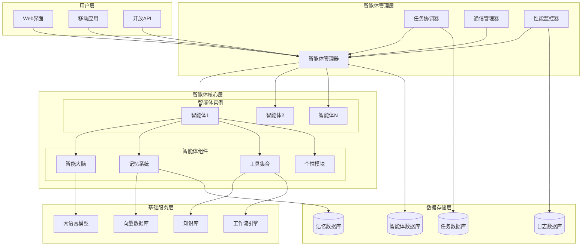

# 🤖 AI Agent 智能体系统 - 详细设计方案

## 📋 目录
- [系统概述](#系统概述)
- [核心架构设计](#核心架构设计)
- [智能体核心组件](#智能体核心组件)
- [多智能体协作机制](#多智能体协作机制)
- [技术实现方案](#技术实现方案)
- [数据库设计](#数据库设计)
- [API接口设计](#api接口设计)
- [前端界面设计](#前端界面设计)
- [部署和扩展](#部署和扩展)
- [测试和验证](#测试和验证)

---

## 🎯 系统概述

### 愿景目标
构建一个能够自主学习、协作和进化的AI智能体生态系统，让用户能够创建个性化的AI助手，并实现多个智能体之间的智能协作。

### 核心价值
- 🧠 **智能自主**: 智能体具备自主决策和学习能力
- 👥 **协作共享**: 多智能体协同完成复杂任务
- 🎯 **个性定制**: 高度可定制的智能体个性和能力
- 📈 **持续进化**: 基于使用反馈的持续学习和优化

### 应用场景
- 🏢 **企业助手**: 专业领域的智能工作助手
- 🎓 **教育导师**: 个性化学习指导和答疑
- 💼 **项目管理**: 智能项目协调和任务分配
- 🔬 **研究助手**: 科研数据分析和文献整理

---

## 🏗️ 核心架构设计

### 整体架构图



### 系统分层架构

#### 1. 用户交互层
- **Web界面**: 智能体创建、配置和监控界面
- **移动应用**: 移动端智能体交互应用
- **开放API**: 第三方系统集成接口

#### 2. 智能体管理层
- **智能体管理器**: 智能体生命周期管理
- **任务协调器**: 多智能体任务分配和协调
- **通信管理器**: 智能体间通信和消息路由
- **性能监控器**: 智能体性能监控和优化

#### 3. 智能体核心层
- **智能体实例**: 独立运行的智能体实例
- **智能大脑**: 基于LLM的推理和决策引擎
- **记忆系统**: 短期、长期和工作记忆管理
- **工具集合**: 智能体可调用的工具和能力
- **个性模块**: 智能体的个性特征和行为模式

#### 4. 基础服务层
- **大语言模型**: GPT、Claude等LLM服务
- **向量数据库**: 语义搜索和记忆存储
- **知识库**: 领域知识和文档库
- **工作流引擎**: 复杂任务的工作流执行

#### 5. 数据存储层
- **智能体数据库**: 智能体配置和状态数据
- **记忆数据库**: 智能体记忆和学习数据
- **任务数据库**: 任务执行历史和结果
- **日志数据库**: 系统运行日志和监控数据

---

## 🧠 智能体核心组件

### 1. 智能体定义模型

```typescript
interface AIAgent {
  // 基本信息
  id: string;
  name: string;
  displayName: string;
  description: string;
  avatar: string;
  
  // 智能体配置
  personality: AgentPersonality;
  capabilities: AgentCapability[];
  knowledgeBases: string[];
  tools: AgentTool[];
  
  // 运行状态
  status: AgentStatus;
  currentTask?: Task;
  performance: AgentPerformance;
  
  // 学习和记忆
  memory: AgentMemory;
  learningModel: LearningConfiguration;
  
  // 协作配置
  collaborationRules: CollaborationRule[];
  communicationPreferences: CommunicationPreference[];
  
  // 元数据
  createdBy: string;
  createdAt: Date;
  updatedAt: Date;
  version: string;
}
```

### 2. 智能体个性系统

```typescript
interface AgentPersonality {
  // 基础特征
  traits: {
    openness: number;        // 开放性 (0-1)
    conscientiousness: number; // 尽责性 (0-1)
    extraversion: number;    // 外向性 (0-1)
    agreeableness: number;   // 宜人性 (0-1)
    neuroticism: number;     // 神经质 (0-1)
  };
  
  // 沟通风格
  communicationStyle: {
    formality: 'formal' | 'casual' | 'friendly';
    verbosity: 'concise' | 'moderate' | 'detailed';
    tone: 'professional' | 'enthusiastic' | 'empathetic';
    humor: boolean;
  };
  
  // 工作偏好
  workPreferences: {
    decisionMaking: 'analytical' | 'intuitive' | 'collaborative';
    riskTolerance: 'conservative' | 'moderate' | 'aggressive';
    learningStyle: 'visual' | 'auditory' | 'kinesthetic';
    multitasking: boolean;
  };
  
  // 专业领域
  expertise: {
    domains: string[];
    proficiencyLevels: Map<string, number>;
    certifications: string[];
  };
}
```

### 3. 智能体能力系统

```typescript
interface AgentCapability {
  id: string;
  name: string;
  type: CapabilityType;
  description: string;
  
  // 能力配置
  configuration: CapabilityConfiguration;
  dependencies: string[];
  
  // 性能指标
  performance: {
    accuracy: number;
    speed: number;
    reliability: number;
    usageCount: number;
  };
  
  // 学习状态
  learningStatus: {
    isLearning: boolean;
    trainingData: TrainingDataReference[];
    modelVersion: string;
    lastUpdated: Date;
  };
}

enum CapabilityType {
  TEXT_PROCESSING = 'text_processing',
  IMAGE_ANALYSIS = 'image_analysis',
  DATA_ANALYSIS = 'data_analysis',
  CODE_GENERATION = 'code_generation',
  WORKFLOW_EXECUTION = 'workflow_execution',
  KNOWLEDGE_RETRIEVAL = 'knowledge_retrieval',
  COMMUNICATION = 'communication',
  DECISION_MAKING = 'decision_making',
  LEARNING = 'learning',
  CUSTOM = 'custom'
}
```

### 4. 记忆系统架构

```typescript
interface AgentMemory {
  // 工作记忆 (临时存储当前任务相关信息)
  workingMemory: {
    currentContext: Map<string, any>;
    activeGoals: Goal[];
    temporaryData: Map<string, any>;
    attentionFocus: string[];
  };
  
  // 短期记忆 (最近的交互和经验)
  shortTermMemory: {
    recentInteractions: Interaction[];
    recentTasks: Task[];
    recentLearnings: Learning[];
    maxRetentionPeriod: Duration;
  };
  
  // 长期记忆 (持久化的知识和经验)
  longTermMemory: {
    factualKnowledge: VectorStore;
    proceduralKnowledge: ProcedureStore;
    episodicMemory: EpisodeStore;
    semanticMemory: ConceptStore;
  };
  
  // 元记忆 (关于记忆的记忆)
  metaMemory: {
    memoryStrategies: MemoryStrategy[];
    forgettingCurve: ForgettingCurveModel;
    importanceWeights: Map<string, number>;
    retrievalPatterns: RetrievalPattern[];
  };
}
```

---

## 👥 多智能体协作机制

### 1. 协作架构设计

```typescript
interface MultiAgentSystem {
  // 智能体集合
  agents: Map<string, AIAgent>;
  
  // 协作配置
  collaborationTopology: CollaborationTopology;
  communicationProtocol: CommunicationProtocol;
  taskDistribution: TaskDistributionStrategy;
  
  // 协调机制
  coordinator: SystemCoordinator;
  conflictResolver: ConflictResolver;
  resourceManager: ResourceManager;
  
  // 监控和优化
  performanceMonitor: CollaborationMonitor;
  optimizer: CollaborationOptimizer;
}
```

### 2. 任务分解和分配

```typescript
interface TaskDecomposition {
  // 任务分析
  analyzeTask(task: ComplexTask): TaskAnalysis;
  
  // 任务分解
  decomposeTask(task: ComplexTask): SubTask[];
  
  // 智能体匹配
  matchAgentsToTasks(subTasks: SubTask[], agents: AIAgent[]): TaskAssignment[];
  
  // 依赖管理
  manageDependencies(assignments: TaskAssignment[]): DependencyGraph;
}

interface TaskAssignment {
  taskId: string;
  agentId: string;
  priority: number;
  estimatedDuration: Duration;
  requiredCapabilities: string[];
  dependencies: string[];
  deadline?: Date;
}
```

### 3. 智能体通信协议

```typescript
interface AgentCommunication {
  // 消息类型
  messageTypes: {
    REQUEST: 'request';           // 请求协助
    RESPONSE: 'response';         // 响应请求
    NOTIFICATION: 'notification'; // 状态通知
    COORDINATION: 'coordination'; // 协调消息
    LEARNING: 'learning';         // 学习分享
  };
  
  // 通信协议
  protocol: {
    messageFormat: MessageFormat;
    routingStrategy: RoutingStrategy;
    reliabilityMechanism: ReliabilityMechanism;
    securityProtocol: SecurityProtocol;
  };
  
  // 消息处理
  messageHandler: MessageHandler;
  messageQueue: MessageQueue;
  messageRouter: MessageRouter;
}

interface AgentMessage {
  id: string;
  senderId: string;
  receiverId: string;
  type: MessageType;
  content: any;
  timestamp: Date;
  priority: number;
  requiresResponse: boolean;
  correlationId?: string;
}
```

### 4. 冲突解决机制

```typescript
interface ConflictResolution {
  // 冲突检测
  detectConflicts(agents: AIAgent[], tasks: Task[]): Conflict[];
  
  // 冲突类型
  conflictTypes: {
    RESOURCE_CONFLICT: 'resource_conflict';     // 资源冲突
    GOAL_CONFLICT: 'goal_conflict';             // 目标冲突
    PRIORITY_CONFLICT: 'priority_conflict';     // 优先级冲突
    CAPABILITY_CONFLICT: 'capability_conflict'; // 能力冲突
  };
  
  // 解决策略
  resolutionStrategies: {
    NEGOTIATION: NegotiationStrategy;           // 协商策略
    ARBITRATION: ArbitrationStrategy;           // 仲裁策略
    VOTING: VotingStrategy;                     // 投票策略
    PRIORITY_BASED: PriorityBasedStrategy;      // 优先级策略
  };
}
```

---

## 💻 技术实现方案

### 1. 后端核心实现

#### 智能体管理服务

```java
@Service
@Slf4j
public class AgentManagementService {
    
    @Autowired
    private AgentRepository agentRepository;
    
    @Autowired
    private LangChain4jService langChainService;
    
    @Autowired
    private MemoryService memoryService;
    
    @Autowired
    private TaskCoordinationService taskCoordinationService;
    
    /**
     * 创建新的智能体
     */
    public AIAgent createAgent(CreateAgentRequest request) {
        // 1. 验证请求参数
        validateCreateRequest(request);
        
        // 2. 初始化智能体配置
        AIAgent agent = AIAgent.builder()
            .id(UUID.randomUUID().toString())
            .name(request.getName())
            .displayName(request.getDisplayName())
            .description(request.getDescription())
            .personality(initializePersonality(request.getPersonalityConfig()))
            .capabilities(initializeCapabilities(request.getCapabilities()))
            .status(AgentStatus.INITIALIZING)
            .createdAt(LocalDateTime.now())
            .build();
        
        // 3. 初始化记忆系统
        AgentMemory memory = memoryService.initializeMemory(agent.getId());
        agent.setMemory(memory);
        
        // 4. 配置LLM连接
        configureLLMConnection(agent, request.getLlmConfig());
        
        // 5. 保存智能体
        agent = agentRepository.save(agent);
        
        // 6. 启动智能体
        startAgent(agent);
        
        log.info("Created new agent: {}", agent.getId());
        return agent;
    }
    
    /**
     * 启动智能体
     */
    public void startAgent(AIAgent agent) {
        try {
            // 1. 加载智能体配置
            loadAgentConfiguration(agent);
            
            // 2. 初始化工具和能力
            initializeAgentTools(agent);
            
            // 3. 连接到协作网络
            taskCoordinationService.registerAgent(agent);
            
            // 4. 更新状态
            agent.setStatus(AgentStatus.ACTIVE);
            agentRepository.save(agent);
            
            log.info("Agent {} started successfully", agent.getId());
            
        } catch (Exception e) {
            log.error("Failed to start agent {}: {}", agent.getId(), e.getMessage());
            agent.setStatus(AgentStatus.ERROR);
            agentRepository.save(agent);
            throw new AgentStartupException("Failed to start agent", e);
        }
    }
    
    /**
     * 执行智能体任务
     */
    public TaskResult executeTask(String agentId, Task task) {
        AIAgent agent = getAgent(agentId);
        
        try {
            // 1. 任务预处理
            Task processedTask = preprocessTask(agent, task);
            
            // 2. 更新工作记忆
            updateWorkingMemory(agent, processedTask);
            
            // 3. 生成执行计划
            ExecutionPlan plan = generateExecutionPlan(agent, processedTask);
            
            // 4. 执行任务
            TaskResult result = executeTaskWithPlan(agent, processedTask, plan);
            
            // 5. 更新记忆和学习
            updateMemoryAndLearning(agent, processedTask, result);
            
            // 6. 返回结果
            return result;
            
        } catch (Exception e) {
            log.error("Task execution failed for agent {}: {}", agentId, e.getMessage());
            return TaskResult.failure(e.getMessage());
        }
    }
    
    private ExecutionPlan generateExecutionPlan(AIAgent agent, Task task) {
        // 使用LLM生成执行计划
        String prompt = buildPlanningPrompt(agent, task);
        String planResponse = langChainService.generateResponse(prompt, agent.getId());
        
        return ExecutionPlanParser.parse(planResponse);
    }
    
    private TaskResult executeTaskWithPlan(AIAgent agent, Task task, ExecutionPlan plan) {
        TaskResult result = new TaskResult();
        
        for (ExecutionStep step : plan.getSteps()) {
            try {
                // 执行单个步骤
                StepResult stepResult = executeStep(agent, step);
                result.addStepResult(stepResult);
                
                // 检查是否需要协作
                if (stepResult.requiresCollaboration()) {
                    CollaborationRequest colabRequest = createCollaborationRequest(agent, step);
                    CollaborationResult colabResult = taskCoordinationService.requestCollaboration(colabRequest);
                    result.addCollaborationResult(colabResult);
                }
                
            } catch (Exception e) {
                log.error("Step execution failed: {}", e.getMessage());
                result.addError(step.getId(), e.getMessage());
            }
        }
        
        return result;
    }
}
```

#### 任务协调服务

```java
@Service
@Slf4j
public class TaskCoordinationService {
    
    @Autowired
    private AgentRegistry agentRegistry;
    
    @Autowired
    private MessageBroker messageBroker;
    
    @Autowired
    private ConflictResolver conflictResolver;
    
    /**
     * 协调多智能体任务执行
     */
    public CoordinationResult coordinateTask(ComplexTask complexTask) {
        try {
            // 1. 任务分析和分解
            TaskAnalysis analysis = analyzeTask(complexTask);
            List<SubTask> subTasks = decomposeTask(complexTask, analysis);
            
            // 2. 智能体匹配和分配
            List<TaskAssignment> assignments = assignTasksToAgents(subTasks);
            
            // 3. 依赖关系管理
            DependencyGraph dependencies = buildDependencyGraph(assignments);
            
            // 4. 执行协调
            ExecutionCoordinator coordinator = new ExecutionCoordinator(assignments, dependencies);
            CoordinationResult result = coordinator.execute();
            
            return result;
            
        } catch (Exception e) {
            log.error("Task coordination failed: {}", e.getMessage());
            return CoordinationResult.failure(e.getMessage());
        }
    }
    
    /**
     * 智能体任务分配算法
     */
    private List<TaskAssignment> assignTasksToAgents(List<SubTask> subTasks) {
        List<TaskAssignment> assignments = new ArrayList<>();
        
        for (SubTask subTask : subTasks) {
            // 1. 获取可用智能体
            List<AIAgent> availableAgents = agentRegistry.getAvailableAgents();
            
            // 2. 能力匹配评分
            Map<AIAgent, Double> capabilityScores = calculateCapabilityScores(subTask, availableAgents);
            
            // 3. 负载均衡评分
            Map<AIAgent, Double> loadScores = calculateLoadScores(availableAgents);
            
            // 4. 综合评分和选择
            AIAgent selectedAgent = selectBestAgent(capabilityScores, loadScores);
            
            // 5. 创建任务分配
            TaskAssignment assignment = TaskAssignment.builder()
                .taskId(subTask.getId())
                .agentId(selectedAgent.getId())
                .priority(subTask.getPriority())
                .estimatedDuration(estimateTaskDuration(subTask, selectedAgent))
                .build();
                
            assignments.add(assignment);
        }
        
        return assignments;
    }
    
    /**
     * 处理协作请求
     */
    public CollaborationResult requestCollaboration(CollaborationRequest request) {
        try {
            // 1. 查找合适的协作智能体
            List<AIAgent> collaborators = findCollaborators(request);
            
            // 2. 发送协作消息
            List<CollaborationResponse> responses = sendCollaborationMessages(request, collaborators);
            
            // 3. 处理响应和冲突
            CollaborationResult result = processCollaborationResponses(responses);
            
            // 4. 冲突解决
            if (result.hasConflicts()) {
                result = conflictResolver.resolveConflicts(result);
            }
            
            return result;
            
        } catch (Exception e) {
            log.error("Collaboration request failed: {}", e.getMessage());
            return CollaborationResult.failure(e.getMessage());
        }
    }
}
```

#### 记忆管理服务

```java
@Service
@Slf4j
public class MemoryService {
    
    @Autowired
    private VectorStoreService vectorStoreService;
    
    @Autowired
    private RedisTemplate<String, Object> redisTemplate;
    
    @Autowired
    private MemoryRepository memoryRepository;
    
    /**
     * 初始化智能体记忆系统
     */
    public AgentMemory initializeMemory(String agentId) {
        AgentMemory memory = AgentMemory.builder()
            .agentId(agentId)
            .workingMemory(new WorkingMemory())
            .shortTermMemory(new ShortTermMemory())
            .longTermMemory(initializeLongTermMemory(agentId))
            .metaMemory(new MetaMemory())
            .build();
            
        return memoryRepository.save(memory);
    }
    
    /**
     * 存储记忆
     */
    public void storeMemory(String agentId, MemoryItem memoryItem) {
        AgentMemory memory = getAgentMemory(agentId);
        
        // 1. 确定记忆类型和重要性
        MemoryType type = classifyMemoryType(memoryItem);
        double importance = calculateImportance(memoryItem);
        
        // 2. 根据类型存储到不同的记忆系统
        switch (type) {
            case WORKING:
                storeInWorkingMemory(memory, memoryItem);
                break;
            case SHORT_TERM:
                storeInShortTermMemory(memory, memoryItem);
                break;
            case LONG_TERM:
                storeInLongTermMemory(memory, memoryItem, importance);
                break;
        }
        
        // 3. 更新元记忆
        updateMetaMemory(memory, memoryItem, type, importance);
        
        // 4. 触发记忆整合
        if (shouldTriggerConsolidation(memory)) {
            consolidateMemories(memory);
        }
    }
    
    /**
     * 检索记忆
     */
    public List<MemoryItem> retrieveMemory(String agentId, MemoryQuery query) {
        AgentMemory memory = getAgentMemory(agentId);
        List<MemoryItem> results = new ArrayList<>();
        
        // 1. 工作记忆检索
        results.addAll(searchWorkingMemory(memory, query));
        
        // 2. 短期记忆检索
        results.addAll(searchShortTermMemory(memory, query));
        
        // 3. 长期记忆检索（向量搜索）
        results.addAll(searchLongTermMemory(memory, query));
        
        // 4. 根据相关性和重要性排序
        results.sort((a, b) -> Double.compare(
            calculateRelevanceScore(b, query), 
            calculateRelevanceScore(a, query)
        ));
        
        // 5. 更新检索统计
        updateRetrievalStatistics(memory, query, results);
        
        return results;
    }
    
    /**
     * 记忆整合和遗忘
     */
    @Scheduled(fixedRate = 3600000) // 每小时执行一次
    public void consolidateMemories() {
        List<String> activeAgents = agentRegistry.getActiveAgentIds();
        
        for (String agentId : activeAgents) {
            try {
                AgentMemory memory = getAgentMemory(agentId);
                
                // 1. 短期记忆到长期记忆的转移
                transferShortToLongTerm(memory);
                
                // 2. 应用遗忘曲线
                applyForgettingCurve(memory);
                
                // 3. 记忆压缩和优化
                compressMemories(memory);
                
                // 4. 更新记忆索引
                updateMemoryIndex(memory);
                
            } catch (Exception e) {
                log.error("Memory consolidation failed for agent {}: {}", agentId, e.getMessage());
            }
        }
    }
    
    private void storeInLongTermMemory(AgentMemory memory, MemoryItem item, double importance) {
        // 1. 生成向量嵌入
        Embedding embedding = vectorStoreService.generateEmbedding(item.getContent());
        
        // 2. 存储到向量数据库
        String memoryId = vectorStoreService.store(
            memory.getAgentId() + "_longterm",
            embedding,
            item.getContent(),
            Map.of(
                "importance", importance,
                "timestamp", item.getTimestamp(),
                "type", item.getType(),
                "tags", item.getTags()
            )
        );
        
        // 3. 更新记忆索引
        memory.getLongTermMemory().addMemoryReference(memoryId, importance);
    }
}
```

### 2. 前端实现方案

#### 智能体管理界面

```typescript
// 智能体创建组件
import React, { useState } from 'react';
import { Form, Input, Select, Slider, Card, Button, Steps, message } from 'antd';
import { RobotOutlined, BrainOutlined, ToolOutlined } from '@ant-design/icons';

const { Step } = Steps;
const { TextArea } = Input;
const { Option } = Select;

interface AgentCreationWizardProps {
  onComplete: (agent: AIAgent) => void;
}

export const AgentCreationWizard: React.FC<AgentCreationWizardProps> = ({ onComplete }) => {
  const [currentStep, setCurrentStep] = useState(0);
  const [form] = Form.useForm();
  const [agentConfig, setAgentConfig] = useState<Partial<CreateAgentRequest>>({});

  const steps = [
    {
      title: '基本信息',
      icon: <RobotOutlined />,
      content: <BasicInfoStep />
    },
    {
      title: '个性配置',
      icon: <BrainOutlined />,
      content: <PersonalityStep />
    },
    {
      title: '能力选择',
      icon: <ToolOutlined />,
      content: <CapabilitiesStep />
    }
  ];

  const BasicInfoStep = () => (
    <Card title="智能体基本信息" className="mb-4">
      <Form form={form} layout="vertical">
        <Form.Item
          name="name"
          label="智能体名称"
          rules={[{ required: true, message: '请输入智能体名称' }]}
        >
          <Input placeholder="例如：数据分析助手" />
        </Form.Item>
        
        <Form.Item
          name="displayName"
          label="显示名称"
          rules={[{ required: true, message: '请输入显示名称' }]}
        >
          <Input placeholder="例如：小数" />
        </Form.Item>
        
        <Form.Item
          name="description"
          label="描述"
          rules={[{ required: true, message: '请输入智能体描述' }]}
        >
          <TextArea 
            rows={4} 
            placeholder="描述智能体的主要功能和特点..."
          />
        </Form.Item>
        
        <Form.Item
          name="avatar"
          label="头像"
        >
          <AvatarUploader />
        </Form.Item>
      </Form>
    </Card>
  );

  const PersonalityStep = () => (
    <Card title="个性特征配置" className="mb-4">
      <div className="space-y-6">
        <div>
          <h4 className="mb-4">五大人格特征</h4>
          <div className="space-y-4">
            <PersonalitySlider
              label="开放性"
              description="对新体验和创新想法的接受程度"
              name="openness"
            />
            <PersonalitySlider
              label="尽责性"
              description="做事的认真程度和责任感"
              name="conscientiousness"
            />
            <PersonalitySlider
              label="外向性"
              description="社交活跃度和表达欲望"
              name="extraversion"
            />
            <PersonalitySlider
              label="宜人性"
              description="合作性和信任度"
              name="agreeableness"
            />
            <PersonalitySlider
              label="神经质"
              description="情绪稳定性和压力承受能力"
              name="neuroticism"
            />
          </div>
        </div>
        
        <div>
          <h4 className="mb-4">沟通风格</h4>
          <Form form={form} layout="vertical">
            <Form.Item name="communicationStyle.formality" label="正式程度">
              <Select>
                <Option value="formal">正式</Option>
                <Option value="casual">随意</Option>
                <Option value="friendly">友好</Option>
              </Select>
            </Form.Item>
            
            <Form.Item name="communicationStyle.verbosity" label="详细程度">
              <Select>
                <Option value="concise">简洁</Option>
                <Option value="moderate">适中</Option>
                <Option value="detailed">详细</Option>
              </Select>
            </Form.Item>
          </Form>
        </div>
      </div>
    </Card>
  );

  const PersonalitySlider: React.FC<{
    label: string;
    description: string;
    name: string;
  }> = ({ label, description, name }) => (
    <div>
      <div className="flex justify-between items-center mb-2">
        <span className="font-medium">{label}</span>
        <span className="text-sm text-gray-500">{description}</span>
      </div>
      <Slider
        min={0}
        max={1}
        step={0.1}
        marks={{
          0: '低',
          0.5: '中',
          1: '高'
        }}
        onChange={(value) => {
          setAgentConfig(prev => ({
            ...prev,
            personality: {
              ...prev.personality,
              traits: {
                ...prev.personality?.traits,
                [name]: value
              }
            }
          }));
        }}
      />
    </div>
  );

  const CapabilitiesStep = () => (
    <Card title="能力配置" className="mb-4">
      <CapabilitySelector
        onCapabilitiesChange={(capabilities) => {
          setAgentConfig(prev => ({
            ...prev,
            capabilities
          }));
        }}
      />
    </Card>
  );

  const handleNext = async () => {
    try {
      await form.validateFields();
      const values = form.getFieldsValue();
      setAgentConfig(prev => ({ ...prev, ...values }));
      setCurrentStep(currentStep + 1);
    } catch (error) {
      message.error('请完善当前步骤的信息');
    }
  };

  const handlePrevious = () => {
    setCurrentStep(currentStep - 1);
  };

  const handleCreate = async () => {
    try {
      const agent = await createAgent(agentConfig);
      message.success('智能体创建成功！');
      onComplete(agent);
    } catch (error) {
      message.error('创建失败，请重试');
    }
  };

  return (
    <div className="max-w-4xl mx-auto p-6">
      <Steps current={currentStep} className="mb-8">
        {steps.map(step => (
          <Step key={step.title} title={step.title} icon={step.icon} />
        ))}
      </Steps>

      <div className="min-h-96">
        {steps[currentStep].content}
      </div>

      <div className="flex justify-between mt-8">
        <Button 
          onClick={handlePrevious} 
          disabled={currentStep === 0}
        >
          上一步
        </Button>
        
        {currentStep < steps.length - 1 ? (
          <Button type="primary" onClick={handleNext}>
            下一步
          </Button>
        ) : (
          <Button type="primary" onClick={handleCreate}>
            创建智能体
          </Button>
        )}
      </div>
    </div>
  );
};
```

#### 智能体协作界面

```typescript
// 多智能体协作看板
import React, { useState, useEffect } from 'react';
import { Card, Avatar, Badge, Progress, Timeline, Button, Modal } from 'antd';
import { TeamOutlined, RobotOutlined, MessageOutlined } from '@ant-design/icons';

export const AgentCollaborationDashboard: React.FC = () => {
  const [agents, setAgents] = useState<AIAgent[]>([]);
  const [currentTask, setCurrentTask] = useState<ComplexTask | null>(null);
  const [collaborationHistory, setCollaborationHistory] = useState<CollaborationEvent[]>([]);

  return (
    <div className="p-6">
      <div className="grid grid-cols-1 lg:grid-cols-3 gap-6">
        {/* 智能体状态面板 */}
        <div className="lg:col-span-2">
          <Card title="智能体协作状态" extra={<TeamOutlined />}>
            <div className="grid grid-cols-1 md:grid-cols-2 gap-4">
              {agents.map(agent => (
                <AgentStatusCard key={agent.id} agent={agent} />
              ))}
            </div>
          </Card>
        </div>

        {/* 任务协调面板 */}
        <div>
          <Card title="任务协调" extra={<Button type="primary">新建协作任务</Button>}>
            {currentTask && (
              <TaskCoordinationPanel task={currentTask} />
            )}
          </Card>
        </div>
      </div>

      {/* 协作历史 */}
      <Card title="协作历史" className="mt-6">
        <Timeline>
          {collaborationHistory.map(event => (
            <Timeline.Item key={event.id}>
              <CollaborationEventItem event={event} />
            </Timeline.Item>
          ))}
        </Timeline>
      </Card>
    </div>
  );
};

const AgentStatusCard: React.FC<{ agent: AIAgent }> = ({ agent }) => {
  const getStatusColor = (status: AgentStatus) => {
    switch (status) {
      case 'ACTIVE': return 'green';
      case 'BUSY': return 'orange';
      case 'IDLE': return 'blue';
      case 'ERROR': return 'red';
      default: return 'gray';
    }
  };

  return (
    <Card size="small" className="agent-status-card">
      <div className="flex items-center space-x-3">
        <Badge status={getStatusColor(agent.status)} dot>
          <Avatar src={agent.avatar} icon={<RobotOutlined />} />
        </Badge>
        
        <div className="flex-1">
          <h4 className="font-medium">{agent.displayName}</h4>
          <p className="text-sm text-gray-500">{agent.status}</p>
          
          {agent.currentTask && (
            <div className="mt-2">
              <p className="text-xs text-gray-400">当前任务</p>
              <p className="text-sm">{agent.currentTask.name}</p>
              <Progress 
                percent={agent.currentTask.progress} 
                size="small" 
                className="mt-1"
              />
            </div>
          )}
        </div>
        
        <Button 
          type="text" 
          icon={<MessageOutlined />}
          onClick={() => openAgentChat(agent.id)}
        />
      </div>
    </Card>
  );
};
```

---

## 🗄️ 数据库设计

### 1. 智能体相关表结构

```sql
-- 智能体基本信息表
CREATE TABLE ai_agents (
    id VARCHAR(36) PRIMARY KEY,
    name VARCHAR(100) NOT NULL,
    display_name VARCHAR(100) NOT NULL,
    description TEXT,
    avatar VARCHAR(500),
    status VARCHAR(20) NOT NULL DEFAULT 'INITIALIZING',
    
    -- 个性配置 (JSON)
    personality JSONB,
    
    -- 能力配置 (JSON数组)
    capabilities JSONB,
    
    -- 知识库关联
    knowledge_bases JSONB,
    
    -- 工具配置
    tools JSONB,
    
    -- 学习配置
    learning_config JSONB,
    
    -- 协作配置
    collaboration_rules JSONB,
    
    -- 性能指标
    performance_metrics JSONB,
    
    -- 元数据
    created_by VARCHAR(36) NOT NULL,
    created_at TIMESTAMP DEFAULT CURRENT_TIMESTAMP,
    updated_at TIMESTAMP DEFAULT CURRENT_TIMESTAMP,
    version VARCHAR(20) DEFAULT '1.0.0',
    
    -- 索引
    INDEX idx_agents_status (status),
    INDEX idx_agents_created_by (created_by),
    INDEX idx_agents_created_at (created_at)
);

-- 智能体记忆表
CREATE TABLE agent_memories (
    id VARCHAR(36) PRIMARY KEY,
    agent_id VARCHAR(36) NOT NULL,
    memory_type VARCHAR(20) NOT NULL, -- WORKING, SHORT_TERM, LONG_TERM, META
    
    -- 记忆内容
    content TEXT NOT NULL,
    content_vector VECTOR(1536), -- 向量嵌入
    
    -- 记忆属性
    importance DECIMAL(3,2) DEFAULT 0.5,
    access_count INT DEFAULT 0,
    last_accessed TIMESTAMP,
    
    -- 关联信息
    related_task_id VARCHAR(36),
    related_interaction_id VARCHAR(36),
    tags JSONB,
    
    -- 时间信息
    created_at TIMESTAMP DEFAULT CURRENT_TIMESTAMP,
    expires_at TIMESTAMP,
    
    FOREIGN KEY (agent_id) REFERENCES ai_agents(id) ON DELETE CASCADE,
    
    -- 索引
    INDEX idx_memories_agent_id (agent_id),
    INDEX idx_memories_type (memory_type),
    INDEX idx_memories_importance (importance),
    INDEX idx_memories_created_at (created_at)
);

-- 智能体任务表
CREATE TABLE agent_tasks (
    id VARCHAR(36) PRIMARY KEY,
    agent_id VARCHAR(36) NOT NULL,
    parent_task_id VARCHAR(36), -- 父任务ID（用于任务分解）
    
    -- 任务信息
    name VARCHAR(200) NOT NULL,
    description TEXT,
    type VARCHAR(50) NOT NULL,
    priority INT DEFAULT 5,
    status VARCHAR(20) NOT NULL DEFAULT 'PENDING',
    
    -- 任务配置
    input_data JSONB,
    output_data JSONB,
    execution_plan JSONB,
    
    -- 时间信息
    estimated_duration INT, -- 预估时长（秒）
    actual_duration INT,    -- 实际时长（秒）
    started_at TIMESTAMP,
    completed_at TIMESTAMP,
    deadline TIMESTAMP,
    
    -- 协作信息
    requires_collaboration BOOLEAN DEFAULT FALSE,
    collaboration_agents JSONB, -- 协作智能体列表
    
    -- 元数据
    created_at TIMESTAMP DEFAULT CURRENT_TIMESTAMP,
    updated_at TIMESTAMP DEFAULT CURRENT_TIMESTAMP,
    
    FOREIGN KEY (agent_id) REFERENCES ai_agents(id) ON DELETE CASCADE,
    FOREIGN KEY (parent_task_id) REFERENCES agent_tasks(id) ON DELETE CASCADE,
    
    -- 索引
    INDEX idx_tasks_agent_id (agent_id),
    INDEX idx_tasks_status (status),
    INDEX idx_tasks_priority (priority),
    INDEX idx_tasks_created_at (created_at)
);

-- 智能体通信记录表
CREATE TABLE agent_communications (
    id VARCHAR(36) PRIMARY KEY,
    sender_agent_id VARCHAR(36) NOT NULL,
    receiver_agent_id VARCHAR(36) NOT NULL,
    
    -- 消息信息
    message_type VARCHAR(20) NOT NULL, -- REQUEST, RESPONSE, NOTIFICATION, etc.
    content TEXT NOT NULL,
    priority INT DEFAULT 5,
    
    -- 关联信息
    related_task_id VARCHAR(36),
    correlation_id VARCHAR(36), -- 用于关联请求和响应
    
    -- 状态信息
    status VARCHAR(20) DEFAULT 'SENT', -- SENT, DELIVERED, READ, PROCESSED
    requires_response BOOLEAN DEFAULT FALSE,
    response_deadline TIMESTAMP,
    
    -- 时间信息
    sent_at TIMESTAMP DEFAULT CURRENT_TIMESTAMP,
    delivered_at TIMESTAMP,
    processed_at TIMESTAMP,
    
    FOREIGN KEY (sender_agent_id) REFERENCES ai_agents(id) ON DELETE CASCADE,
    FOREIGN KEY (receiver_agent_id) REFERENCES ai_agents(id) ON DELETE CASCADE,
    FOREIGN KEY (related_task_id) REFERENCES agent_tasks(id) ON DELETE SET NULL,
    
    -- 索引
    INDEX idx_communications_sender (sender_agent_id),
    INDEX idx_communications_receiver (receiver_agent_id),
    INDEX idx_communications_type (message_type),
    INDEX idx_communications_sent_at (sent_at)
);

-- 智能体协作会话表
CREATE TABLE agent_collaboration_sessions (
    id VARCHAR(36) PRIMARY KEY,
    name VARCHAR(200) NOT NULL,
    description TEXT,
    
    -- 参与智能体
    participant_agents JSONB NOT NULL, -- 参与的智能体ID列表
    coordinator_agent_id VARCHAR(36), -- 协调者智能体
    
    -- 会话状态
    status VARCHAR(20) NOT NULL DEFAULT 'ACTIVE', -- ACTIVE, PAUSED, COMPLETED, FAILED
    
    -- 任务信息
    main_task_id VARCHAR(36),
    sub_tasks JSONB, -- 子任务列表
    
    -- 协作规则
    collaboration_rules JSONB,
    conflict_resolution_strategy VARCHAR(50),
    
    -- 时间信息
    started_at TIMESTAMP DEFAULT CURRENT_TIMESTAMP,
    ended_at TIMESTAMP,
    
    -- 结果信息
    result JSONB,
    performance_metrics JSONB,
    
    FOREIGN KEY (coordinator_agent_id) REFERENCES ai_agents(id) ON DELETE SET NULL,
    FOREIGN KEY (main_task_id) REFERENCES agent_tasks(id) ON DELETE SET NULL,
    
    -- 索引
    INDEX idx_collaboration_status (status),
    INDEX idx_collaboration_started_at (started_at)
);

-- 智能体学习记录表
CREATE TABLE agent_learning_records (
    id VARCHAR(36) PRIMARY KEY,
    agent_id VARCHAR(36) NOT NULL,
    
    -- 学习信息
    learning_type VARCHAR(50) NOT NULL, -- FEEDBACK, OBSERVATION, COLLABORATION, etc.
    source VARCHAR(100), -- 学习来源
    content TEXT NOT NULL,
    
    -- 学习结果
    insights JSONB, -- 学到的洞察
    behavior_changes JSONB, -- 行为改变
    performance_impact DECIMAL(3,2), -- 性能影响 (-1 到 1)
    
    -- 验证信息
    validation_status VARCHAR(20) DEFAULT 'PENDING', -- PENDING, VALIDATED, REJECTED
    validation_feedback TEXT,
    
    -- 时间信息
    learned_at TIMESTAMP DEFAULT CURRENT_TIMESTAMP,
    applied_at TIMESTAMP,
    validated_at TIMESTAMP,
    
    FOREIGN KEY (agent_id) REFERENCES ai_agents(id) ON DELETE CASCADE,
    
    -- 索引
    INDEX idx_learning_agent_id (agent_id),
    INDEX idx_learning_type (learning_type),
    INDEX idx_learning_learned_at (learned_at)
);
```

### 2. 向量数据库设计 (Chroma)

```python
# 智能体记忆向量存储设计
class AgentMemoryVectorStore:
    def __init__(self, chroma_client):
        self.client = chroma_client
        
    def create_agent_memory_collection(self, agent_id: str):
        """为智能体创建记忆向量集合"""
        collection_name = f"agent_{agent_id}_memories"
        
        collection = self.client.create_collection(
            name=collection_name,
            metadata={
                "agent_id": agent_id,
                "description": f"Memory collection for agent {agent_id}",
                "created_at": datetime.now().isoformat()
            }
        )
        
        return collection
    
    def store_memory(self, agent_id: str, memory_item: MemoryItem):
        """存储记忆项到向量数据库"""
        collection = self.client.get_collection(f"agent_{agent_id}_memories")
        
        collection.add(
            documents=[memory_item.content],
            metadatas=[{
                "memory_id": memory_item.id,
                "memory_type": memory_item.type,
                "importance": memory_item.importance,
                "timestamp": memory_item.timestamp.isoformat(),
                "tags": memory_item.tags,
                "access_count": memory_item.access_count
            }],
            ids=[memory_item.id]
        )
    
    def search_memories(self, agent_id: str, query: str, limit: int = 10):
        """搜索相关记忆"""
        collection = self.client.get_collection(f"agent_{agent_id}_memories")
        
        results = collection.query(
            query_texts=[query],
            n_results=limit,
            include=["documents", "metadatas", "distances"]
        )
        
        return results
```

---

## 🔌 API接口设计

### 1. 智能体管理API

```yaml
# OpenAPI 3.0 规范
openapi: 3.0.0
info:
  title: AI Agent System API
  version: 1.0.0
  description: AI智能体系统API接口

paths:
  /api/agents:
    post:
      summary: 创建智能体
      requestBody:
        required: true
        content:
          application/json:
            schema:
              $ref: '#/components/schemas/CreateAgentRequest'
      responses:
        '201':
          description: 智能体创建成功
          content:
            application/json:
              schema:
                $ref: '#/components/schemas/AIAgent'
    
    get:
      summary: 获取智能体列表
      parameters:
        - name: status
          in: query
          schema:
            type: string
            enum: [ACTIVE, IDLE, BUSY, ERROR]
        - name: page
          in: query
          schema:
            type: integer
            default: 0
        - name: size
          in: query
          schema:
            type: integer
            default: 20
      responses:
        '200':
          description: 智能体列表
          content:
            application/json:
              schema:
                type: object
                properties:
                  content:
                    type: array
                    items:
                      $ref: '#/components/schemas/AIAgent'
                  totalElements:
                    type: integer
                  totalPages:
                    type: integer

  /api/agents/{agentId}:
    get:
      summary: 获取智能体详情
      parameters:
        - name: agentId
          in: path
          required: true
          schema:
            type: string
      responses:
        '200':
          description: 智能体详情
          content:
            application/json:
              schema:
                $ref: '#/components/schemas/AIAgent'
    
    put:
      summary: 更新智能体配置
      parameters:
        - name: agentId
          in: path
          required: true
          schema:
            type: string
      requestBody:
        required: true
        content:
          application/json:
            schema:
              $ref: '#/components/schemas/UpdateAgentRequest'
      responses:
        '200':
          description: 更新成功
          content:
            application/json:
              schema:
                $ref: '#/components/schemas/AIAgent'
    
    delete:
      summary: 删除智能体
      parameters:
        - name: agentId
          in: path
          required: true
          schema:
            type: string
      responses:
        '204':
          description: 删除成功

  /api/agents/{agentId}/tasks:
    post:
      summary: 分配任务给智能体
      parameters:
        - name: agentId
          in: path
          required: true
          schema:
            type: string
      requestBody:
        required: true
        content:
          application/json:
            schema:
              $ref: '#/components/schemas/TaskRequest'
      responses:
        '201':
          description: 任务创建成功
          content:
            application/json:
              schema:
                $ref: '#/components/schemas/Task'

  /api/agents/{agentId}/chat:
    post:
      summary: 与智能体对话
      parameters:
        - name: agentId
          in: path
          required: true
          schema:
            type: string
      requestBody:
        required: true
        content:
          application/json:
            schema:
              type: object
              properties:
                message:
                  type: string
                context:
                  type: object
      responses:
        '200':
          description: 对话响应
          content:
            application/json:
              schema:
                type: object
                properties:
                  response:
                    type: string
                  context:
                    type: object
                  suggestions:
                    type: array
                    items:
                      type: string

  /api/collaboration/sessions:
    post:
      summary: 创建协作会话
      requestBody:
        required: true
        content:
          application/json:
            schema:
              $ref: '#/components/schemas/CreateCollaborationRequest'
      responses:
        '201':
          description: 协作会话创建成功
          content:
            application/json:
              schema:
                $ref: '#/components/schemas/CollaborationSession'

components:
  schemas:
    CreateAgentRequest:
      type: object
      required:
        - name
        - displayName
        - description
      properties:
        name:
          type: string
          maxLength: 100
        displayName:
          type: string
          maxLength: 100
        description:
          type: string
        avatar:
          type: string
        personality:
          $ref: '#/components/schemas/AgentPersonality'
        capabilities:
          type: array
          items:
            $ref: '#/components/schemas/AgentCapability'
        knowledgeBases:
          type: array
          items:
            type: string
        tools:
          type: array
          items:
            $ref: '#/components/schemas/AgentTool'
        learningConfig:
          $ref: '#/components/schemas/LearningConfiguration'

    AIAgent:
      type: object
      properties:
        id:
          type: string
        name:
          type: string
        displayName:
          type: string
        description:
          type: string
        avatar:
          type: string
        status:
          type: string
          enum: [INITIALIZING, ACTIVE, IDLE, BUSY, ERROR, STOPPED]
        personality:
          $ref: '#/components/schemas/AgentPersonality'
        capabilities:
          type: array
          items:
            $ref: '#/components/schemas/AgentCapability'
        performance:
          $ref: '#/components/schemas/AgentPerformance'
        createdAt:
          type: string
          format: date-time
        updatedAt:
          type: string
          format: date-time

    AgentPersonality:
      type: object
      properties:
        traits:
          type: object
          properties:
            openness:
              type: number
              minimum: 0
              maximum: 1
            conscientiousness:
              type: number
              minimum: 0
              maximum: 1
            extraversion:
              type: number
              minimum: 0
              maximum: 1
            agreeableness:
              type: number
              minimum: 0
              maximum: 1
            neuroticism:
              type: number
              minimum: 0
              maximum: 1
        communicationStyle:
          type: object
          properties:
            formality:
              type: string
              enum: [formal, casual, friendly]
            verbosity:
              type: string
              enum: [concise, moderate, detailed]
            tone:
              type: string
              enum: [professional, enthusiastic, empathetic]
            humor:
              type: boolean
```

### 2. WebSocket 实时通信API

```typescript
// WebSocket 事件定义
interface WebSocketEvents {
  // 智能体状态事件
  'agent:status_changed': {
    agentId: string;
    oldStatus: AgentStatus;
    newStatus: AgentStatus;
    timestamp: Date;
  };
  
  // 任务执行事件
  'task:started': {
    taskId: string;
    agentId: string;
    taskName: string;
    estimatedDuration: number;
  };
  
  'task:progress': {
    taskId: string;
    agentId: string;
    progress: number;
    currentStep: string;
  };
  
  'task:completed': {
    taskId: string;
    agentId: string;
    result: TaskResult;
    actualDuration: number;
  };
  
  // 协作事件
  'collaboration:request': {
    sessionId: string;
    requesterId: string;
    targetAgents: string[];
    taskDescription: string;
  };
  
  'collaboration:response': {
    sessionId: string;
    responderId: string;
    response: 'accept' | 'decline' | 'negotiate';
    message?: string;
  };
  
  // 智能体通信事件
  'agent:message': {
    senderId: string;
    receiverId: string;
    messageType: MessageType;
    content: string;
    timestamp: Date;
  };
  
  // 学习事件
  'agent:learned': {
    agentId: string;
    learningType: string;
    insight: string;
    performanceImpact: number;
  };
}

// WebSocket 客户端
class AgentWebSocketClient {
  private ws: WebSocket;
  private eventHandlers: Map<string, Function[]> = new Map();
  
  constructor(url: string, token: string) {
    this.ws = new WebSocket(`${url}?token=${token}`);
    this.setupEventListeners();
  }
  
  private setupEventListeners() {
    this.ws.onmessage = (event) => {
      const message = JSON.parse(event.data);
      this.handleEvent(message.type, message.data);
    };
  }
  
  public subscribe<T extends keyof WebSocketEvents>(
    eventType: T,
    handler: (data: WebSocketEvents[T]) => void
  ) {
    if (!this.eventHandlers.has(eventType)) {
      this.eventHandlers.set(eventType, []);
    }
    this.eventHandlers.get(eventType)!.push(handler);
  }
  
  public sendMessage(type: string, data: any) {
    this.ws.send(JSON.stringify({ type, data }));
  }
  
  private handleEvent(type: string, data: any) {
    const handlers = this.eventHandlers.get(type);
    if (handlers) {
      handlers.forEach(handler => handler(data));
    }
  }
}
```

---

## 🚀 部署和扩展

### 1. 容器化部署

```dockerfile
# 智能体服务 Dockerfile
FROM openjdk:17-jdk-slim

# 安装必要的工具
RUN apt-get update && apt-get install -y \
    curl \
    wget \
    && rm -rf /var/lib/apt/lists/*

# 设置工作目录
WORKDIR /app

# 复制应用文件
COPY target/agent-system-*.jar app.jar

# 设置环境变量
ENV JAVA_OPTS="-Xms2g -Xmx4g -XX:+UseG1GC"
ENV SPRING_PROFILES_ACTIVE=prod

# 健康检查
HEALTHCHECK --interval=30s --timeout=10s --start-period=60s --retries=3 \
  CMD curl -f http://localhost:8080/actuator/health || exit 1

# 暴露端口
EXPOSE 8080

# 启动应用
ENTRYPOINT ["sh", "-c", "java $JAVA_OPTS -jar app.jar"]
```

```yaml
# docker-compose.yml 扩展
version: '3.8'

services:
  # 智能体管理服务
  agent-manager:
    build: ./backend
    ports:
      - "8080:8080"
    environment:
      - SPRING_PROFILES_ACTIVE=prod
      - DATABASE_URL=jdbc:postgresql://postgres:5432/agent_platform
      - REDIS_URL=redis://redis:6379
      - CHROMA_URL=http://chroma:8000
    depends_on:
      - postgres
      - redis
      - chroma
    deploy:
      replicas: 3
      resources:
        limits:
          memory: 4G
          cpus: '2'
        reservations:
          memory: 2G
          cpus: '1'
    healthcheck:
      test: ["CMD", "curl", "-f", "http://localhost:8080/actuator/health"]
      interval: 30s
      timeout: 10s
      retries: 3

  # 智能体执行引擎
  agent-executor:
    build: ./agent-executor
    environment:
      - AGENT_MANAGER_URL=http://agent-manager:8080
      - LLM_API_KEY=${OPENAI_API_KEY}
    deploy:
      replicas: 5
      resources:
        limits:
          memory: 8G
          cpus: '4'
    depends_on:
      - agent-manager

  # 任务协调服务
  task-coordinator:
    build: ./task-coordinator
    environment:
      - AGENT_MANAGER_URL=http://agent-manager:8080
      - MESSAGE_BROKER_URL=amqp://rabbitmq:5672
    deploy:
      replicas: 2
    depends_on:
      - agent-manager
      - rabbitmq

  # 向量数据库 (Chroma)
  chroma:
    image: chromadb/chroma:latest
    ports:
      - "8000:8000"
    volumes:
      - chroma_data:/chroma/chroma
    environment:
      - CHROMA_SERVER_HOST=0.0.0.0
      - CHROMA_SERVER_HTTP_PORT=8000
    deploy:
      resources:
        limits:
          memory: 4G
          cpus: '2'

  # 消息队列
  rabbitmq:
    image: rabbitmq:3-management
    ports:
      - "5672:5672"
      - "15672:15672"
    environment:
      - RABBITMQ_DEFAULT_USER=agent_user
      - RABBITMQ_DEFAULT_PASS=agent_password
    volumes:
      - rabbitmq_data:/var/lib/rabbitmq

volumes:
  chroma_data:
  rabbitmq_data:
```

### 2. Kubernetes 部署

```yaml
# k8s-agent-system.yml
apiVersion: apps/v1
kind: Deployment
metadata:
  name: agent-manager
  labels:
    app: agent-manager
spec:
  replicas: 3
  selector:
    matchLabels:
      app: agent-manager
  template:
    metadata:
      labels:
        app: agent-manager
    spec:
      containers:
      - name: agent-manager
        image: agent-platform/agent-manager:latest
        ports:
        - containerPort: 8080
        env:
        - name: SPRING_PROFILES_ACTIVE
          value: "k8s"
        - name: DATABASE_URL
          valueFrom:
            secretKeyRef:
              name: database-secret
              key: url
        resources:
          requests:
            memory: "2Gi"
            cpu: "1"
          limits:
            memory: "4Gi"
            cpu: "2"
        livenessProbe:
          httpGet:
            path: /actuator/health
            port: 8080
          initialDelaySeconds: 60
          periodSeconds: 30
        readinessProbe:
          httpGet:
            path: /actuator/health/readiness
            port: 8080
          initialDelaySeconds: 30
          periodSeconds: 10

---
apiVersion: v1
kind: Service
metadata:
  name: agent-manager-service
spec:
  selector:
    app: agent-manager
  ports:
  - protocol: TCP
    port: 80
    targetPort: 8080
  type: LoadBalancer

---
apiVersion: autoscaling/v2
kind: HorizontalPodAutoscaler
metadata:
  name: agent-manager-hpa
spec:
  scaleTargetRef:
    apiVersion: apps/v1
    kind: Deployment
    name: agent-manager
  minReplicas: 3
  maxReplicas: 10
  metrics:
  - type: Resource
    resource:
      name: cpu
      target:
        type: Utilization
        averageUtilization: 70
  - type: Resource
    resource:
      name: memory
      target:
        type: Utilization
        averageUtilization: 80
```

### 3. 监控和告警

```yaml
# prometheus-config.yml
global:
  scrape_interval: 15s

scrape_configs:
  - job_name: 'agent-system'
    static_configs:
      - targets: ['agent-manager:8080']
    metrics_path: '/actuator/prometheus'
    scrape_interval: 10s

  - job_name: 'agent-performance'
    static_configs:
      - targets: ['agent-executor:8081']
    metrics_path: '/metrics'
    scrape_interval: 5s

rule_files:
  - "agent_alerts.yml"

alerting:
  alertmanagers:
    - static_configs:
        - targets:
          - alertmanager:9093
```

```yaml
# agent_alerts.yml
groups:
- name: agent_system_alerts
  rules:
  - alert: AgentHighErrorRate
    expr: rate(agent_task_errors_total[5m]) > 0.1
    for: 2m
    labels:
      severity: warning
    annotations:
      summary: "智能体错误率过高"
      description: "智能体 {{ $labels.agent_id }} 在过去5分钟内错误率超过10%"

  - alert: AgentMemoryUsageHigh
    expr: agent_memory_usage_percent > 90
    for: 5m
    labels:
      severity: critical
    annotations:
      summary: "智能体内存使用率过高"
      description: "智能体 {{ $labels.agent_id }} 内存使用率超过90%"

  - alert: CollaborationSessionTimeout
    expr: collaboration_session_duration_seconds > 3600
    for: 0m
    labels:
      severity: warning
    annotations:
      summary: "协作会话超时"
      description: "协作会话 {{ $labels.session_id }} 运行时间超过1小时"
```

---

## 🧪 测试和验证

### 1. 单元测试

```java
@ExtendWith(MockitoExtension.class)
class AgentManagementServiceTest {
    
    @Mock
    private AgentRepository agentRepository;
    
    @Mock
    private LangChain4jService langChainService;
    
    @Mock
    private MemoryService memoryService;
    
    @InjectMocks
    private AgentManagementService agentManagementService;
    
    @Test
    void testCreateAgent_Success() {
        // Given
        CreateAgentRequest request = CreateAgentRequest.builder()
            .name("test-agent")
            .displayName("测试智能体")
            .description("用于测试的智能体")
            .build();
            
        AIAgent expectedAgent = AIAgent.builder()
            .id("test-id")
            .name(request.getName())
            .displayName(request.getDisplayName())
            .status(AgentStatus.ACTIVE)
            .build();
            
        when(agentRepository.save(any(AIAgent.class))).thenReturn(expectedAgent);
        when(memoryService.initializeMemory(anyString())).thenReturn(new AgentMemory());
        
        // When
        AIAgent result = agentManagementService.createAgent(request);
        
        // Then
        assertThat(result).isNotNull();
        assertThat(result.getName()).isEqualTo(request.getName());
        assertThat(result.getDisplayName()).isEqualTo(request.getDisplayName());
        assertThat(result.getStatus()).isEqualTo(AgentStatus.ACTIVE);
        
        verify(agentRepository).save(any(AIAgent.class));
        verify(memoryService).initializeMemory(anyString());
    }
    
    @Test
    void testExecuteTask_Success() {
        // Given
        String agentId = "test-agent-id";
        Task task = Task.builder()
            .id("test-task-id")
            .name("测试任务")
            .type("TEXT_PROCESSING")
            .inputData(Map.of("text", "Hello, world!"))
            .build();
            
        AIAgent agent = AIAgent.builder()
            .id(agentId)
            .name("test-agent")
            .status(AgentStatus.ACTIVE)
            .build();
            
        when(agentRepository.findById(agentId)).thenReturn(Optional.of(agent));
        when(langChainService.generateResponse(anyString(), anyString()))
            .thenReturn("Task completed successfully");
        
        // When
        TaskResult result = agentManagementService.executeTask(agentId, task);
        
        // Then
        assertThat(result).isNotNull();
        assertThat(result.isSuccess()).isTrue();
        assertThat(result.getOutput()).isNotNull();
        
        verify(langChainService).generateResponse(anyString(), eq(agentId));
    }
}
```

### 2. 集成测试

```java
@SpringBootTest(webEnvironment = SpringBootTest.WebEnvironment.RANDOM_PORT)
@TestPropertySource(properties = {
    "spring.datasource.url=jdbc:h2:mem:testdb",
    "spring.jpa.hibernate.ddl-auto=create-drop"
})
class AgentSystemIntegrationTest {
    
    @Autowired
    private TestRestTemplate restTemplate;
    
    @Autowired
    private AgentRepository agentRepository;
    
    @Test
    void testAgentLifecycle() {
        // 1. 创建智能体
        CreateAgentRequest createRequest = CreateAgentRequest.builder()
            .name("integration-test-agent")
            .displayName("集成测试智能体")
            .description("用于集成测试的智能体")
            .build();
            
        ResponseEntity<AIAgent> createResponse = restTemplate.postForEntity(
            "/api/agents", 
            createRequest, 
            AIAgent.class
        );
        
        assertThat(createResponse.getStatusCode()).isEqualTo(HttpStatus.CREATED);
        AIAgent createdAgent = createResponse.getBody();
        assertThat(createdAgent).isNotNull();
        assertThat(createdAgent.getId()).isNotNull();
        
        // 2. 获取智能体详情
        ResponseEntity<AIAgent> getResponse = restTemplate.getForEntity(
            "/api/agents/" + createdAgent.getId(),
            AIAgent.class
        );
        
        assertThat(getResponse.getStatusCode()).isEqualTo(HttpStatus.OK);
        AIAgent retrievedAgent = getResponse.getBody();
        assertThat(retrievedAgent).isNotNull();
        assertThat(retrievedAgent.getId()).isEqualTo(createdAgent.getId());
        
        // 3. 分配任务
        TaskRequest taskRequest = TaskRequest.builder()
            .name("测试任务")
            .type("TEXT_PROCESSING")
            .inputData(Map.of("text", "Hello, integration test!"))
            .build();
            
        ResponseEntity<Task> taskResponse = restTemplate.postForEntity(
            "/api/agents/" + createdAgent.getId() + "/tasks",
            taskRequest,
            Task.class
        );
        
        assertThat(taskResponse.getStatusCode()).isEqualTo(HttpStatus.CREATED);
        Task createdTask = taskResponse.getBody();
        assertThat(createdTask).isNotNull();
        
        // 4. 等待任务完成
        await().atMost(30, TimeUnit.SECONDS).until(() -> {
            ResponseEntity<Task> statusResponse = restTemplate.getForEntity(
                "/api/tasks/" + createdTask.getId(),
                Task.class
            );
            return statusResponse.getBody().getStatus() == TaskStatus.COMPLETED;
        });
        
        // 5. 删除智能体
        restTemplate.delete("/api/agents/" + createdAgent.getId());
        
        Optional<AIAgent> deletedAgent = agentRepository.findById(createdAgent.getId());
        assertThat(deletedAgent).isEmpty();
    }
}
```

### 3. 性能测试

```java
@Component
public class AgentPerformanceTest {
    
    @Autowired
    private AgentManagementService agentManagementService;
    
    @Test
    void testConcurrentTaskExecution() {
        // 创建测试智能体
        AIAgent agent = createTestAgent();
        
        // 并发任务数量
        int concurrentTasks = 100;
        ExecutorService executor = Executors.newFixedThreadPool(10);
        CountDownLatch latch = new CountDownLatch(concurrentTasks);
        List<Future<TaskResult>> futures = new ArrayList<>();
        
        // 提交并发任务
        for (int i = 0; i < concurrentTasks; i++) {
            final int taskIndex = i;
            Future<TaskResult> future = executor.submit(() -> {
                try {
                    Task task = Task.builder()
                        .id("task-" + taskIndex)
                        .name("并发测试任务 " + taskIndex)
                        .type("TEXT_PROCESSING")
                        .inputData(Map.of("text", "Concurrent task " + taskIndex))
                        .build();
                        
                    TaskResult result = agentManagementService.executeTask(agent.getId(), task);
                    latch.countDown();
                    return result;
                } catch (Exception e) {
                    latch.countDown();
                    throw new RuntimeException(e);
                }
            });
            futures.add(future);
        }
        
        // 等待所有任务完成
        try {
            latch.await(60, TimeUnit.SECONDS);
        } catch (InterruptedException e) {
            Thread.currentThread().interrupt();
        }
        
        // 验证结果
        int successCount = 0;
        for (Future<TaskResult> future : futures) {
            try {
                TaskResult result = future.get();
                if (result.isSuccess()) {
                    successCount++;
                }
            } catch (Exception e) {
                // 记录失败
            }
        }
        
        // 断言成功率
        double successRate = (double) successCount / concurrentTasks;
        assertThat(successRate).isGreaterThan(0.95); // 95%以上成功率
        
        executor.shutdown();
    }
}
```

---

## 📈 性能优化和扩展策略

### 1. 智能体池管理

```java
@Component
public class AgentPoolManager {
    
    private final Map<String, ObjectPool<AIAgent>> agentPools = new ConcurrentHashMap<>();
    
    public ObjectPool<AIAgent> getOrCreateAgentPool(String agentType) {
        return agentPools.computeIfAbsent(agentType, type -> {
            GenericObjectPoolConfig<AIAgent> config = new GenericObjectPoolConfig<>();
            config.setMaxTotal(10);
            config.setMaxIdle(5);
            config.setMinIdle(2);
            config.setTestOnBorrow(true);
            config.setTestOnReturn(true);
            
            return new GenericObjectPool<>(new AgentFactory(type), config);
        });
    }
    
    public AIAgent borrowAgent(String agentType) throws Exception {
        ObjectPool<AIAgent> pool = getOrCreateAgentPool(agentType);
        return pool.borrowObject();
    }
    
    public void returnAgent(String agentType, AIAgent agent) throws Exception {
        ObjectPool<AIAgent> pool = getOrCreateAgentPool(agentType);
        pool.returnObject(agent);
    }
}
```

### 2. 分布式任务调度

```java
@Component
public class DistributedTaskScheduler {
    
    @Autowired
    private RedisTemplate<String, Object> redisTemplate;
    
    @Autowired
    private AgentRegistry agentRegistry;
    
    public void scheduleTask(Task task) {
        // 1. 任务分析
        TaskAnalysis analysis = analyzeTask(task);
        
        // 2. 选择最优节点
        String optimalNode = selectOptimalNode(analysis);
        
        // 3. 分发任务
        distributeTask(task, optimalNode);
    }
    
    private String selectOptimalNode(TaskAnalysis analysis) {
        List<String> availableNodes = agentRegistry.getAvailableNodes();
        
        return availableNodes.stream()
            .min((node1, node2) -> {
                double score1 = calculateNodeScore(node1, analysis);
                double score2 = calculateNodeScore(node2, analysis);
                return Double.compare(score1, score2);
            })
            .orElseThrow(() -> new RuntimeException("No available nodes"));
    }
    
    private double calculateNodeScore(String nodeId, TaskAnalysis analysis) {
        // 综合考虑：负载、能力匹配、网络延迟等
        double loadScore = getNodeLoad(nodeId);
        double capabilityScore = getCapabilityMatch(nodeId, analysis.getRequiredCapabilities());
        double latencyScore = getNetworkLatency(nodeId);
        
        return loadScore * 0.4 + capabilityScore * 0.4 + latencyScore * 0.2;
    }
}
```

---

这个AI Agent智能体系统设计方案提供了完整的架构、实现和部署指南。系统具备高度的可扩展性和灵活性，能够支持复杂的多智能体协作场景。

您希望我详细展开哪个部分，或者有什么特定的问题需要讨论吗？